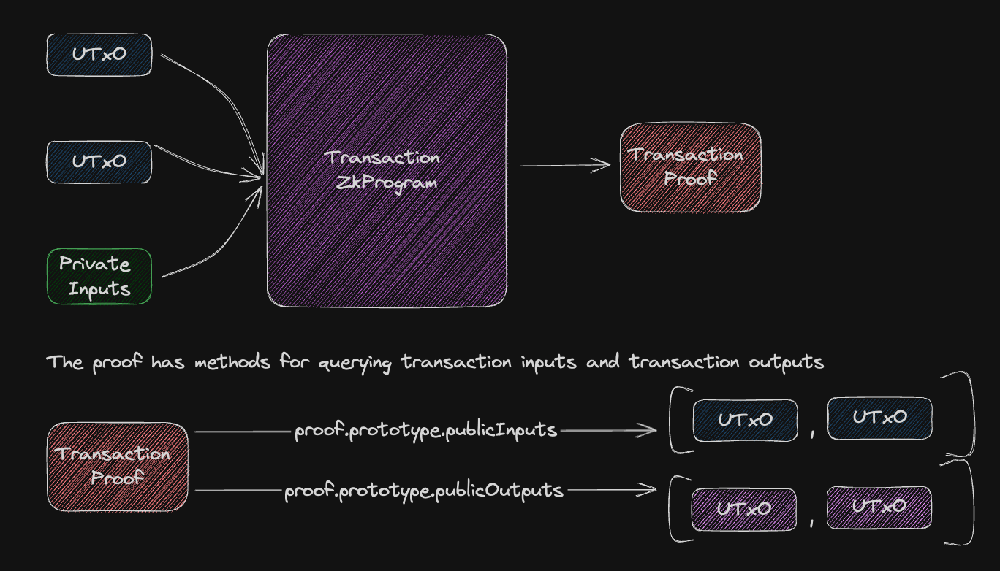

# Dark Matter - a zk-SNARK Private UTxO Ledger

Powered by [Bun](https://github.com/oven-sh/bun). This is just a demo.

## Neutralino 🚧 
A 🔥 blazingly fast 🔥 ElysiaJS server, Neutralino provides foundational services for Dark Matter. With its `LedgerDatabase`, it emulates blockchain ledger characteristics, permitting the storage and querying of UTxOs. In essence, it functions similarly to a rudimentary blockchain node.

### TODO
- Add endpoints for submitting transaction proofs.

## Data Model
This package currently resides within `Neutralino` due to the lack of stable monorepo support in Bun. The Data Model package is pivotal to Dark Matter, defining its foundational data structures. Key components include:

### EncryptedValue
`EncryptedValue` class represents a value that has been encrypted. The structure consists of a public key (`publicKey`) and a cipher text (`cipherText`). This hasn't been implemented in the `Transaction` ZkProgram yet.

**Methods**:
- `toJSON(encryptedValue: EncryptedValueType)`: Converts the encrypted value into a JSON format.
- `fromJSON(encryptedValue: any)`: Parses a JSON representation of the encrypted value, producing the corresponding `EncryptedValueType` object.

### UTXO (Unspent Transaction Output)
`UTXO` class embodies the concept of an unspent transaction output in the context of blockchain. Each UTXO is uniquely identified by an address (`oneTimeAddress`) and has an associated ephemeral public key (`ephemeralPublicKey`) and value (`value`).

**Constructor Logic**:
- Generates a random private key for the transaction.
- Computes a corresponding public key.
- Calculates the shared secret.
- Derives the one-time destination address.

**Methods**:
- `toJSON(utxo: UTXOType)`: Transforms the UTXO into a JSON format.
- `fromJSON(utxo: string)`: Parses a JSON representation of the UTXO, generating the corresponding `UTXOType` object.

## Provable Programs

Provable programs form the backbone of the cryptographic assurance offered by Dark Matter. These programs allow for certain properties or conditions to be proven without revealing the actual data or the specifics of the computation. Let's delve into the core components:

### TxArgs
`TxArgs` represents the arguments for a transaction. The transaction arguments can have a maximum of 2 inputs and 2 outputs. While ideally, the structure would support dynamic array lengths, however this isn't possible yet.

**Methods**:
- `getInputs()`: Returns the inputs for the transaction.
- `getOutputs()`: Returns the outputs for the transaction.

### PrivateTxArgs
`PrivateTxArgs` is an encapsulation of the private arguments required for a transaction. These arguments include the shared secret scalar for inputs, as well as the public view and spend keys of the sender.

The class constructor not only initializes the structure but also computes the shared secrets for an array of UTXOs, which is vital for the privacy-preserving features of Dark Matter.

### Transaction
The `Transaction` provable program is a zk-program that ensures the correct execution of the Dark Matter transactions. The program accepts both public input and output arguments of type `TxArgs`.

**Methods**:
- `spend`: This method validates the integrity of the transaction:
    - Proves the ownership of the input by ensuring the derived one-time address matches with the one in the transaction inputs.
    - Validates value conservation, ensuring that the sum of input values matches the sum of output values.

### TransactionProof
`TransactionProof` is an extension of the zk-program proof for the `Transaction`. It aids in the generation and verification of zk-proofs specific to the Dark Matter transactions.

**Note**: The program, as described, are integral to the privacy and security model of Dark Matter.

## Overview Diagram

**Note**: As this is a demo, users should be cautious about using it in production or for any critical applications. Feedback and contributions are always welcome to help improve the system's robustness and functionality.
